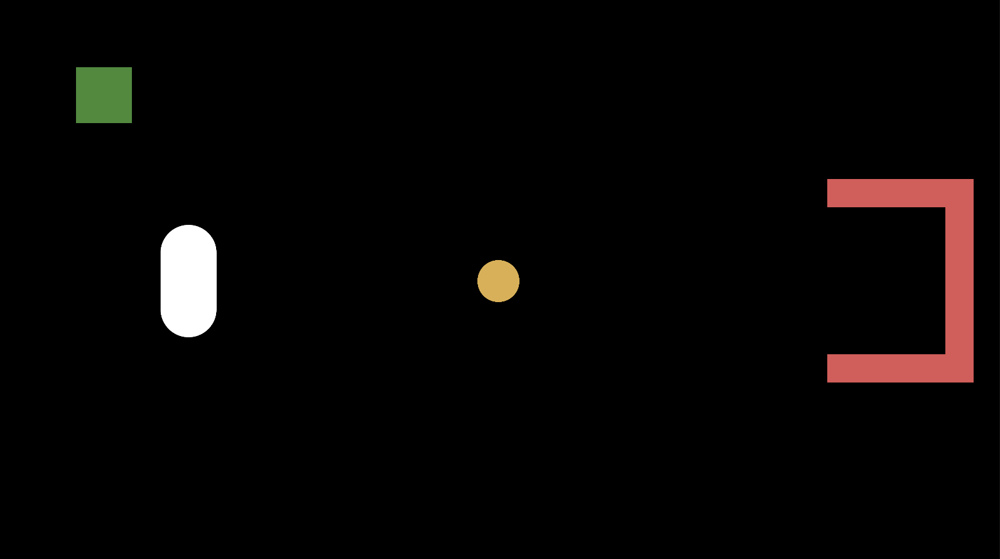
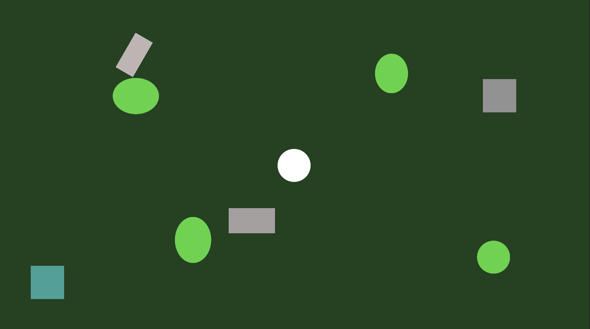

# Week 2: 2D Basics

This is week 2's example project about 2D basics. It covers the following:
- PlayerController / Player Input
- Game Objects
- 2D movement
- Scene Management
- Rigidbodies, Colliders, and Triggers

Make sure to explore the project and play around with it. We will deconstruct it in class.

---

## Soccer Scene

The first scene, the _Soccer Scene_ lets you play in a 2D, minimalist soccer game. You can use the wasd or arrow keys to move the character around. Try to push the ball in the net. If the ball hits the back net, it will respawn in the middle. If the ball leaves the game area, it also respawns in the middle. If you go through the green area, you will move to the other game.



---

## Point 'N Click Scene

The second scene, the _Point 'N Click_ scene lets you play in a 2D top-down area where you can move the character by clicking with your mouse in the area. The character will move to the point where you click. If you go through the blue area, you will go back to the soccer game.



---

## Before Next Lecture

Try to do these before the next lecture:

- [ ] Clone the repo
```bash
git clone https://github.com/Sp0k/w2-2d-basics.git
```
- [ ] Explore the code and try to modify it
- [ ] Play with the project in Unity
- [ ] Write down any questions you might have, I'll answer them in class